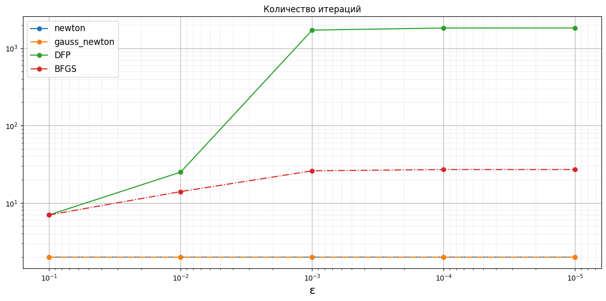
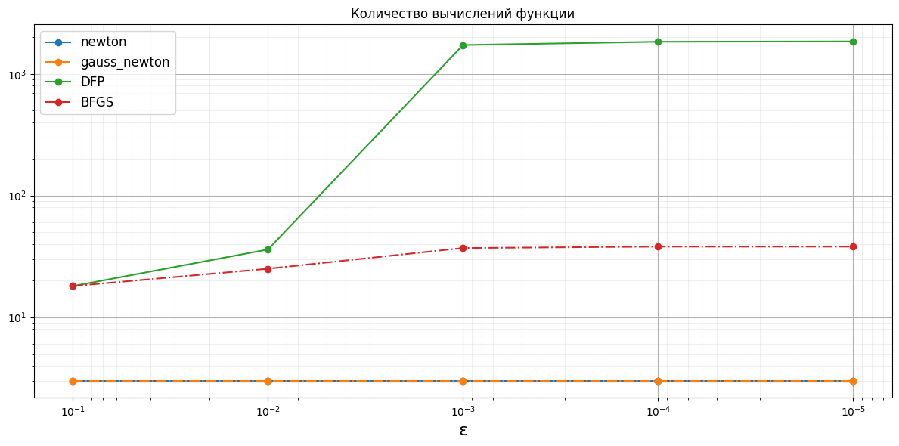
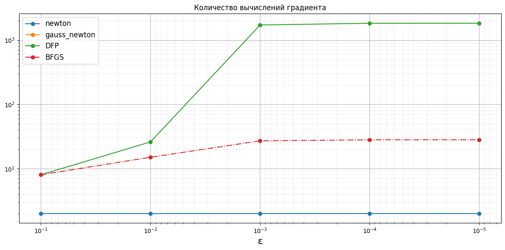
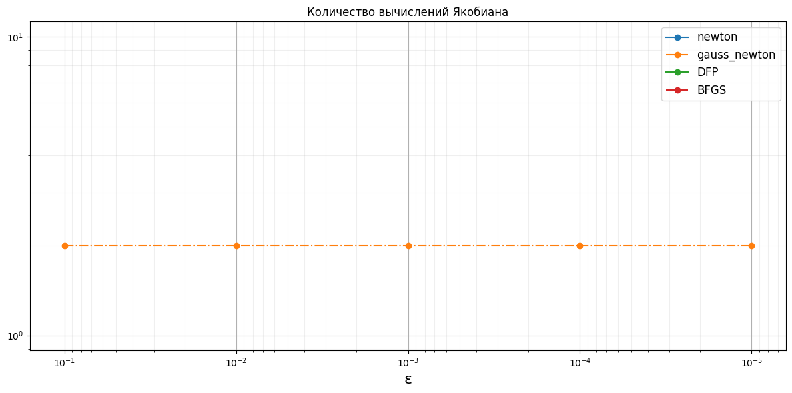
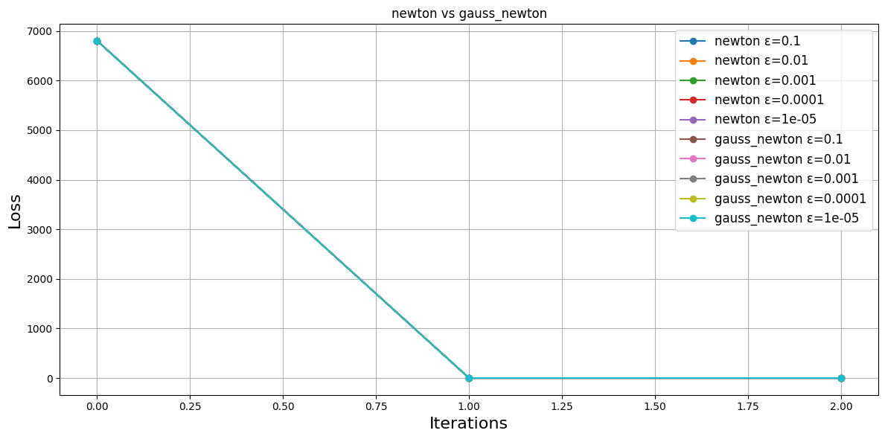
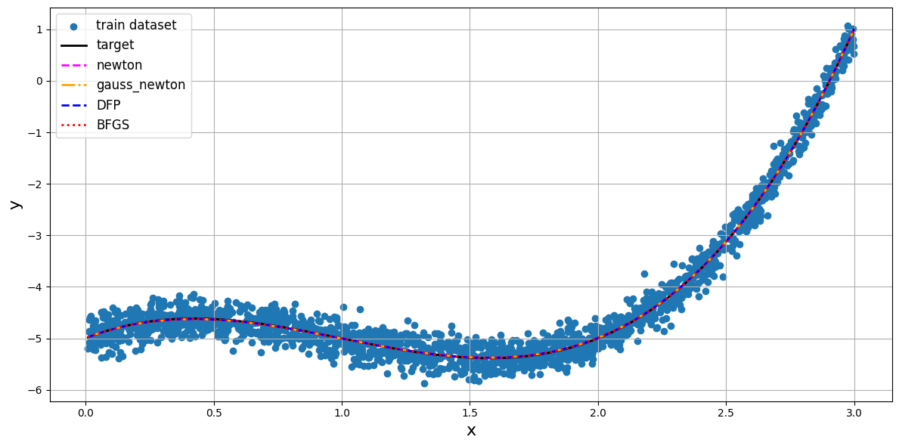

# Методы второго порядка

Расчеты представлены в [notebook.ipynb](notebook.ipynb).

## Набор данных
Сгенерирован датасет синтетических данных размера ${N=2000}$.

В основу генерации положена полиномиальная функция с добавлением случайного шума ${\delta}$

${f(x) = \sum_{k=0}^{K-1}{w_k \cdot x^k} + \delta}$,

где ${w=[w_0, w_1, ..., w_{K-1}]}$ – массив весов размера ${K}$.

Тренировочный датасет [x, y] сгенерирован для ${x \in [0; 3]}$ при следующих весах:
${w=[-5, 2, -3, 1]}$ ${(K=4)}$.

В задаче оптимизации количество весов принято большим на одно ${(K=5)}$, в ожидании получить нулевое значение этого искусственно добавленного коэффициента.

Ожидаемые значения весов (target): ${w=[-5, 2, -3, 1, 0]}$.

## Количество итераций и вычислений

## Динамика функции потерь

## Предсказания

## Приложение с таблицами
<!-- START_W_OPTIM --> 
### Оптимальные веса при ε=1e-05
|   target |      newton |   gauss_newton |         DFP |        BFGS |
|---------:|------------:|---------------:|------------:|------------:|
|       -5 | -4.99321    |    -4.99321    | -4.99328    | -4.99321    |
|        2 |  1.91702    |     1.91702    |  1.91749    |  1.91702    |
|       -3 | -2.87442    |    -2.87442    | -2.87514    | -2.87442    |
|        1 |  0.939803   |     0.939803   |  0.940174   |  0.939803   |
|        0 |  0.00918756 |     0.00918756 |  0.00912689 |  0.00918757 |
<!-- END_W_OPTIM -->
<!-- START_ITER_NUMBER --> 
### Количество итераций
|    eps |   newton |   gauss_newton |   DFP |   BFGS |
|-------:|---------:|---------------:|------:|-------:|
| 0.1    |        2 |              2 |     7 |      7 |
| 0.01   |        2 |              2 |    25 |     14 |
| 0.001  |        2 |              2 |  1716 |     26 |
| 0.0001 |        2 |              2 |  1826 |     27 |
| 1e-05  |        2 |              2 |  1829 |     27 |
<!-- END_ITER_NUMBER -->
<!-- START_FUNC_NUMBER --> 
### Количество вычислений функции
|    eps |   newton |   gauss_newton |   DFP |   BFGS |
|-------:|---------:|---------------:|------:|-------:|
| 0.1    |        3 |              3 |    18 |     18 |
| 0.01   |        3 |              3 |    36 |     25 |
| 0.001  |        3 |              3 |  1727 |     37 |
| 0.0001 |        3 |              3 |  1837 |     38 |
| 1e-05  |        3 |              3 |  1849 |     38 |
<!-- END_FUNC_NUMBER -->
<!-- START_GRAD_NUMBER --> 
### Количество вычислений градиента
|    eps |   newton |   gauss_newton |   DFP |   BFGS |
|-------:|---------:|---------------:|------:|-------:|
| 0.1    |        2 |              0 |     8 |      8 |
| 0.01   |        2 |              0 |    26 |     15 |
| 0.001  |        2 |              0 |  1717 |     27 |
| 0.0001 |        2 |              0 |  1827 |     28 |
| 1e-05  |        2 |              0 |  1830 |     28 |
<!-- END_GRAD_NUMBER -->
<!-- START_HESS_NUMBER --> 
### Количество вычислений Гессиана
|    eps |   newton |   gauss_newton |   DFP |   BFGS |
|-------:|---------:|---------------:|------:|-------:|
| 0.1    |        2 |              2 |     7 |      7 |
| 0.01   |        2 |              2 |    25 |     14 |
| 0.001  |        2 |              2 |  1716 |     26 |
| 0.0001 |        2 |              2 |  1826 |     26 |
| 1e-05  |        2 |              2 |  1827 |     26 |
<!-- END_HESS_NUMBER -->
<!-- START_JACOB_NUMBER --> 
### Количество вычислений Якобиана
|    eps |   newton |   gauss_newton |   DFP |   BFGS |
|-------:|---------:|---------------:|------:|-------:|
| 0.1    |        0 |              2 |     0 |      0 |
| 0.01   |        0 |              2 |     0 |      0 |
| 0.001  |        0 |              2 |     0 |      0 |
| 0.0001 |        0 |              2 |     0 |      0 |
| 1e-05  |        0 |              2 |     0 |      0 |
<!-- END_JACOB_NUMBER -->